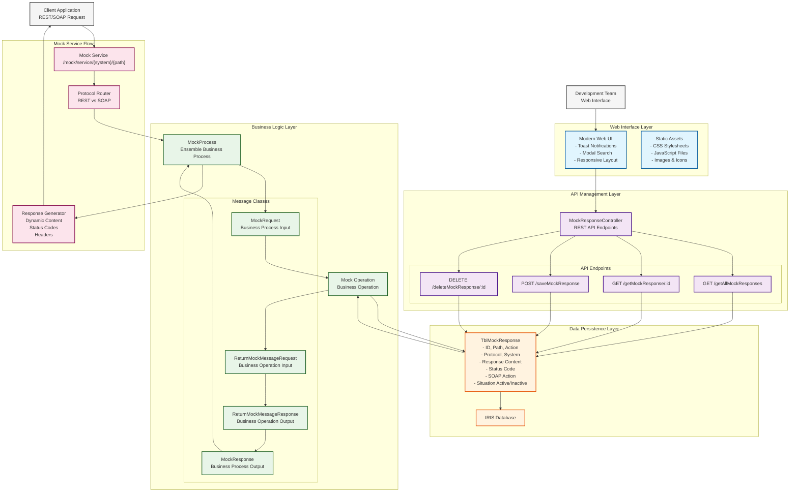
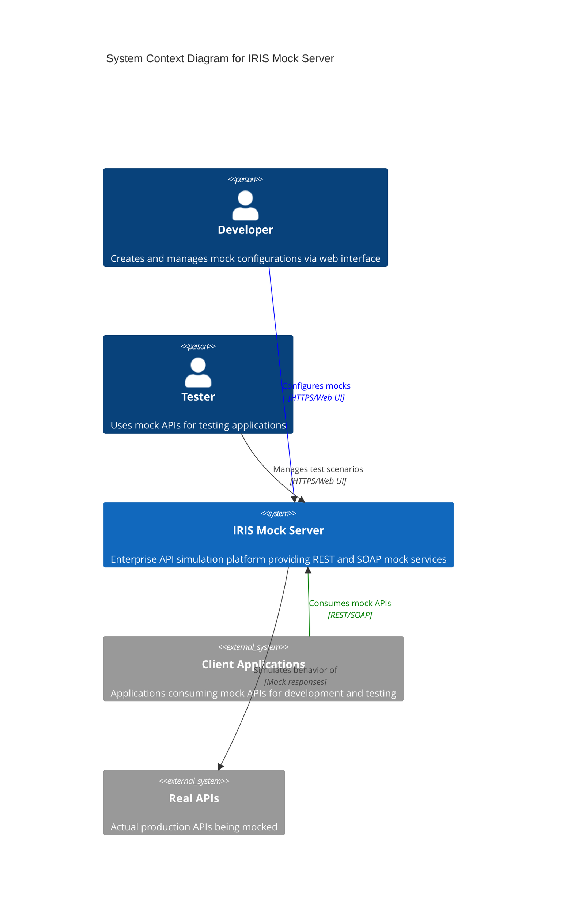
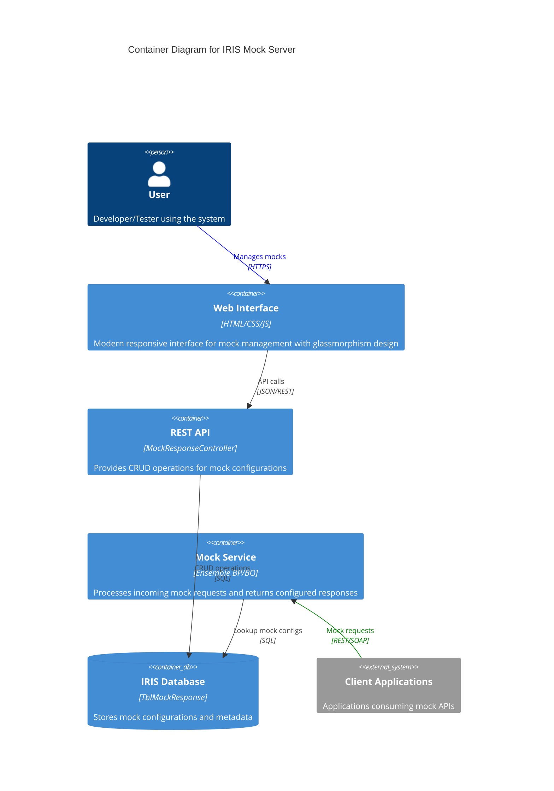
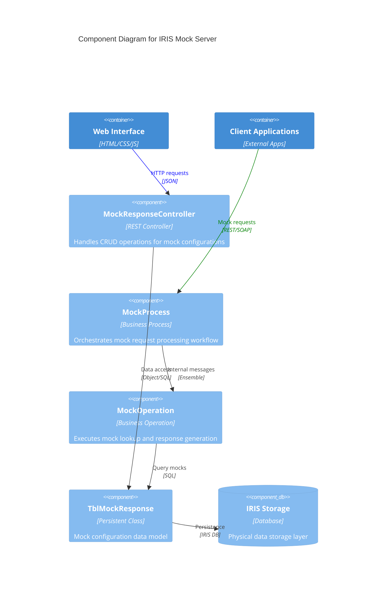
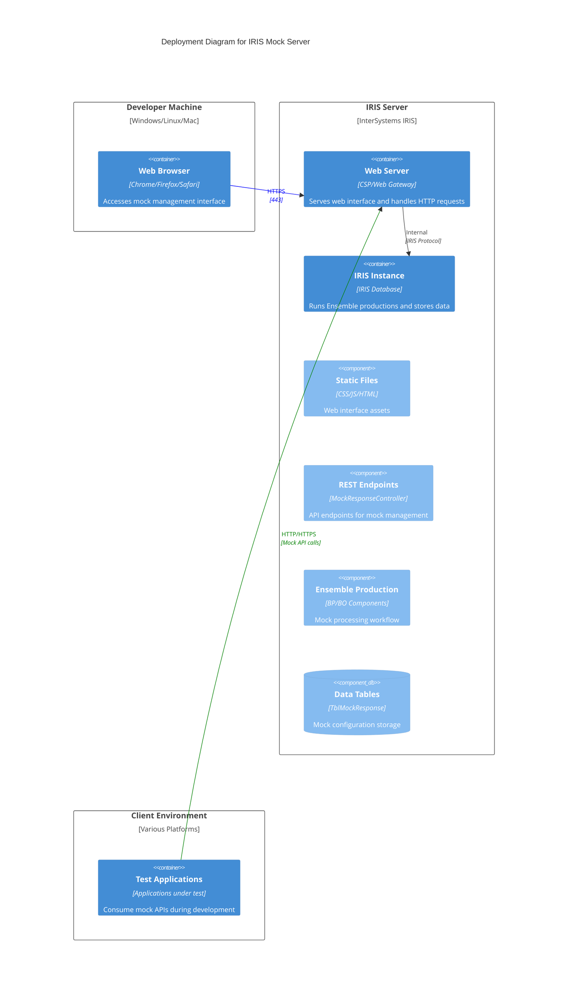

 [](https://openexchange.intersystems.com/package/iris-mock-server)


[](LICENSE)
# Iris Mock Server

## Description
IRIS Mock Server simplifies API development by simulating REST and SOAP endpoints with zero-code configuration. Featuring a modern web interface and native Ensemble integration, it enables developers to quickly create and manage mocks, accelerating testing and eliminating external dependencies.

## Funcionalidades
- Support for REST and SOAP protocols
- Web interface for creating and editing mocks
- Customizable response configuration
- Ability to define content-type and status code
- Zero-code: fully configurable through the interface
- Runs via Docker with embedded InterSystems IRIS

## Getting Started

### Prerequisites
- [Git (Optional, for repository clone)](https://git-scm.com/book/en/v2/Getting-Started-Installing-Git) 
- [Docker Desktop](https://www.docker.com/products/docker-desktop/)

### Clone the Repository
Clone or pull the repository into a local directory:

```bash
git clone git@github.com:rodoctor/iris-mock-server.git
```
Navigate to the directory and run:
```bash
cd iris-mock-server
```
Run docker compose
```bash
docker-compose up -d
```

Access the interface at: <br>
http://localhost:52773/app/index.html

### IPM
Open IRIS installation with IPM client installed:
```bash
IRISAPP>zpm "install iris-mock-server"
```

### Management portal
The management portal is available at: <br>
http://localhost:52773/csp/irisapp/EnsPortal.ProductionConfig.zen?$NAMESPACE=IRISAPP&

## Architecture Overview

## Using Example

## Project Structure
### Structure
```bash
.
└── src
    ├── IORedirect
    ├── activation
    ├── api
    │   └── rest
    ├── core
    │   ├── bo
    │   ├── bp
    │   ├── bs
    │   │   └── http
    │   ├── model
    │   │   └── http
    │   ├── msg
    │   │   ├── bo
    │   │   └── bp
    │   └── prd
    ├── csp
    │   └── irisapp
    │       └── assets
    └── data
        └── enum
```

## Contributing
Contributions are welcome and appreciated!
If you have suggestions for improvements, bug reports, or want to add new features, feel free to open an issue or submit a pull request.

Whether it’s code, documentation, ideas, or testing — your help is welcome. 

## Contributors
Rodolfo Moreira <br> <a href="https://www.linkedin.com/in/rodoctor/"></a>


# Teste







